[](https://gitter.im/fair-acc/chart?utm_source=badge&utm_medium=badge&utm_campaign=pr-badge&utm_content=badge)
[](https://opensource.org/licenses/LGPL-3.0)
[](https://search.maven.org/search?q=g:io.fair_acc.chartfx+AND+a:chart+AND+v:11*)

[](https://www.codacy.com/app/GSI/chart-fx?utm_source=github.com&amp;utm_medium=referral&amp;utm_content=fair-acc/chart-fx&amp;utm_campaign=Badge_Grade)
[](https://lgtm.com/projects/g/fair-acc/chart-fx/context:java)
[](https://scan.coverity.com/projects/chart-fx)


# ChartFx

ChartFx is a scientific charting library developed at [GSI](https://www.gsi.de) for FAIR with focus on performance optimised real-time data visualisation at 25 Hz update rates for data sets with a few 10 thousand up to 5 million data points common in digital signal processing applications.
Based on earlier Swing-based designs used at GSI and CERN, it is a re-write of JavaFX's default [Chart](https://docs.oracle.com/javase/8/javafx/api/javafx/scene/chart/Chart.html) implementation and aims to preserve the feature-rich and extensible functionality of earlier and other similar Swing-based libraries while addressing the performance bottlenecks and API issues.
The motivation for the re-design has been presented at [IPAC'19](https://ipac19.org/) ([paper](docs/THPRB028.pdf), [poster](docs/THPRB028_poster.pdf)). You can see a recent presentation at [JFX Days](https://www.jfx-days.com/) [here](https://youtu.be/NK4pgRF9XWk).

<figure>
  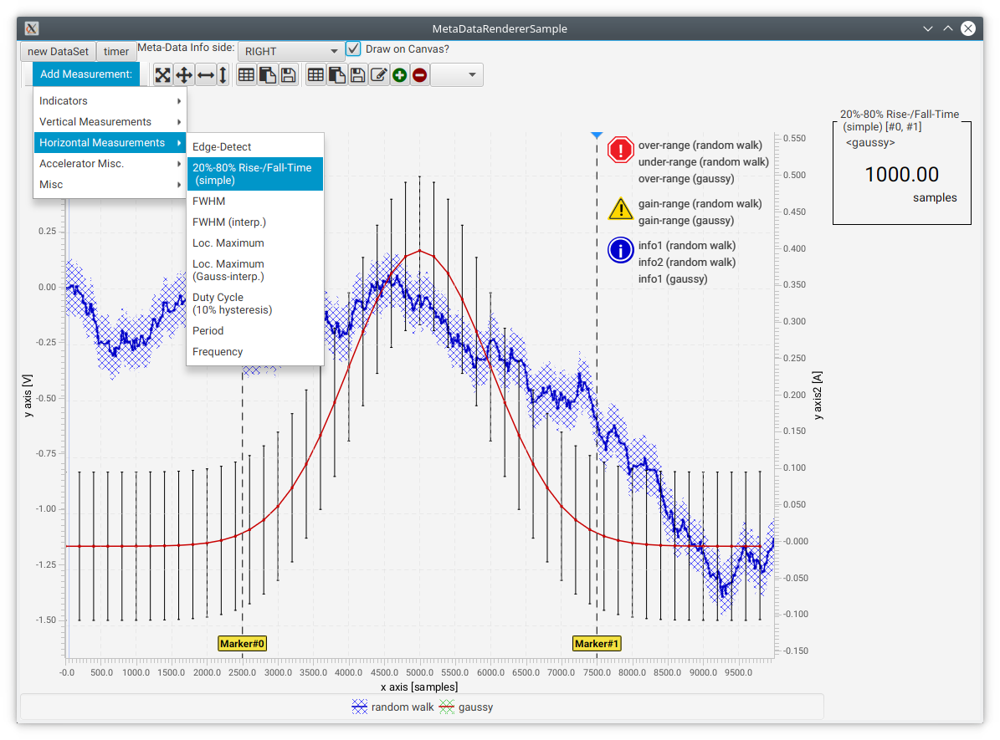
  <figcaption>
  Example showing error-bar and error-surface representations, display of mock meta-data, `ChartPlugin` interactors and data parameter measurement indicators (here: '20%-80% rise-time' between 'Marker#0' and 'Marker#1').
  </figcaption>
</figure>

## Functionalities and Features
The library offers a wide variety of plot types common in the scientific signal processing field, a flexible plugin system as well as online parameter measurements commonly found in lab instrumentation. Some of its features include (see demos for more details):
*   `DataSet`: basic XY-type datasets, extendable by `DataSetError` to account for measurement uncertainties, `DataSetMetaData`, `EditableDataSet`, `Histogram`, or `DataSet3D` interfaces;
*   math sub-library: FFTs, Wavelet and other spectral and linear algebra routines, numerically robust integration and differentiation, IIR- & FIR-type filtering, linear regression and non-linear chi-square-type function fitting;
*   `Chart`: providing euclidean, polar, or 2D projections of 3D data sets, and a configurable legend;
*   `Axis`: one or multiple axes that are linear, logarithmic, time-series, inverted, dynamic auto-(grow)-ranging, automatic range-based SI and time unit conversion;
*   `Renderer`: scatter-plot, poly-line, area-plot, error-bar and error-surfaces, vertical bar-plots, Bezier-curve, stair-case, 1D/2D histograms, mountain-range display, true contour plots, heatmaps, fading DataSet history, labelled chart range and indicator marker, hexagon-map, meta data (i.e. for indicating common measurement errors, warnings or infos such as over- or under-ranging, device or configuration errors etc.);
*   `ChartPlugin`: data zoomer with history, zoom-to-origin, and option to limit this to X and/or Y coordinates, panner, data value and range indicators, cross-hair indicator, data point tool-tip, `DataSet` editing, table view, export to CSV and system clipboard, online axis editing, data set parameter measurement such as rise-time, min, max, rms, etc.

In order to provide some of the scenegraph-level functionality while using a `Canvas` as graphics backend, the functionality of each module was extended to be readily customized through direct API methods as well as through external CSS-type style sheets.

## Example Usage

### Add the library to your project
All chart-fx releases are deployed to maven central, for maven you can add it to your pom.xml like this:

```Maven POM
<dependencies>
  <dependency>
    <groupId>io.fair-acc</groupId>
    <artifactId>chartfx</artifactId>
    <version>11.3.0</version>
  </dependency>
</dependencies>
```

or your build.gradle like this:

```gradle
implementation 'io.fair-acc:chartfx:11.3.0'
```

To use different build systems or library versions, have a look at the snippets on [maven central](https://search.maven.org/search?q=g:io.fair-acc%20AND%20a:chartfx&core=gav).

While most users will need the `chartfx-chart` artifact it is also possible to use the data containers from `chartfx-dataset`
and the algorithms from `chartfx-math` independently without the quite heavy UI dependencies.

#### Using the snapshot repository

If you want to try out unreleased features from master or one of the feature branches, there is no need to download the source and build chart-fx yourself. You can just use the `<branchname>-SNAPSHOT` releases  from the sonatype snapshot repository for example by adding the following to your pom.xml if you want to use the current master.
All available snapshot releases can be found in the [sonatype snapshot repository](https://oss.sonatype.org/content/repositories/snapshots/io/fair-acc/).
<details><summary>
example pom.xml for current master (click to expand)
</summary>

```xml
<dependencies>
    <dependency>
        <groupId>io.fair-acc</groupId>
        <artifactId>chartfx</artifactId>
        <version>master-SNAPSHOT</version>
        <!-- <version>master-20200320.180638-78</version> pin to a specific snapshot build-->
    </dependency>
</dependencies>
<repositories>
    <repository>
        <id>oss.sonatype.org-snapshot</id>
        <url>http://oss.sonatype.org/content/repositories/snapshots</url>
        <releases>
            <enabled>false</enabled>
        </releases>
        <snapshots>
            <enabled>true</enabled>
        </snapshots>
    </repository>
</repositories>
```
</details>

### Code Example

The following minimal working example can be used as a boilerplate project to get started with chart-fx.

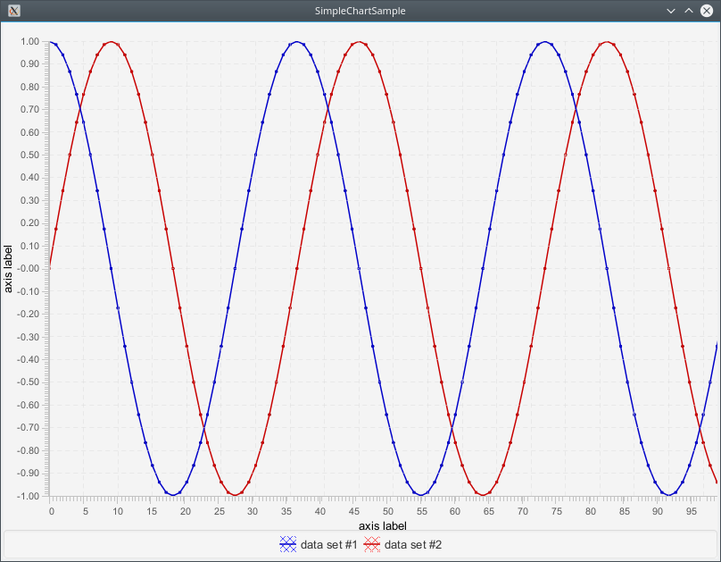

<details><summary>The corresponding source code `ChartFxSample.java` (expand)</summary>

```Java
package com.example.chartfx;

import io.fair_acc.chartfx.XYChart;
import io.fair_acc.chartfx.axes.spi.DefaultNumericAxis;
import io.fair_acc.dataset.spi.DoubleDataSet;
import javafx.application.Application;
import javafx.scene.Scene;
import javafx.scene.layout.StackPane;
import javafx.stage.Stage;

public class SimpleChartSample extends Application {
    private static final int N_SAMPLES = 100;

    @Override
    public void start(final Stage primaryStage) {
        final StackPane root = new StackPane();

        final XYChart chart = new XYChart(new DefaultNumericAxis(), new DefaultNumericAxis());
        root.getChildren().add(chart);

        final DoubleDataSet dataSet1 = new DoubleDataSet("data set #1");
        final DoubleDataSet dataSet2 = new DoubleDataSet("data set #2");
        // lineChartPlot.getDatasets().add(dataSet1); // for single data set
        chart.getDatasets().addAll(dataSet1, dataSet2); // two data sets

        final double[] xValues = new double[N_SAMPLES];
        final double[] yValues1 = new double[N_SAMPLES];
        final double[] yValues2 = new double[N_SAMPLES];
        for (int n = 0; n < N_SAMPLES; n++) {
            xValues[n] = n;
            yValues1[n] = Math.cos(Math.toRadians(10.0 * n));
            yValues2[n] = Math.sin(Math.toRadians(10.0 * n));
        }
        dataSet1.set(xValues, yValues1);
        dataSet2.set(xValues, yValues2);

        final Scene scene = new Scene(root, 800, 600);
        primaryStage.setTitle(this.getClass().getSimpleName());
        primaryStage.setScene(scene);
        primaryStage.setOnCloseRequest(evt -> System.exit(0));
        primaryStage.show();
    }
    public static void main(final String[] args) {
        Application.launch(args);
    }
}
```
</details><details><summary>And the corresponding build specification(expand)</summary>
pom.xml:

```Maven POM
<project>
<groupId>com.example.chartfx</groupId>
<artifactId>chartfx-sample</artifactId>
<name>chart-fx Sample</name>
<dependencies>
  <dependency>
    <groupId>io.fair_acc</groupId>
    <artifactId>chartfx</artifactId>
    <version>11.3.0</version>
  </dependency>
  <dependency>
    <groupId>org.slf4j</groupId>
    <artifactId>slf4j-simple</artifactId>
    <version>2.0.0-alpha0</version>
  </dependency>
</dependencies>
</project>
```
</details>
<details><summary>run with (expand)</summary>

```bash
mvn compile install
mvn exec:java
```
</details>

## Examples
The chart-fx samples submodule contains a lot of samples which illustrate the capabilities and usage of the library.
If you want to try them yourself run:

```bash
mvn compile install
mvn exec:java
```

<table>

<tr>
<td><figure>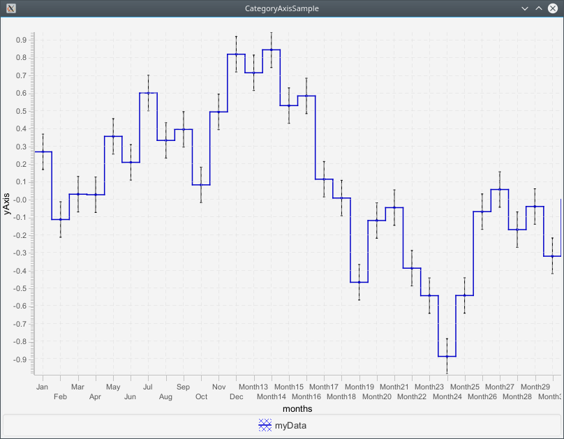<figcaption><a href="chartfx-samples/src/main/java/io/fair_acc/chart/samples/CategoryAxisSample.java">CategoryAxisSample.java</a></figcaption></figure></td>
<td><figure>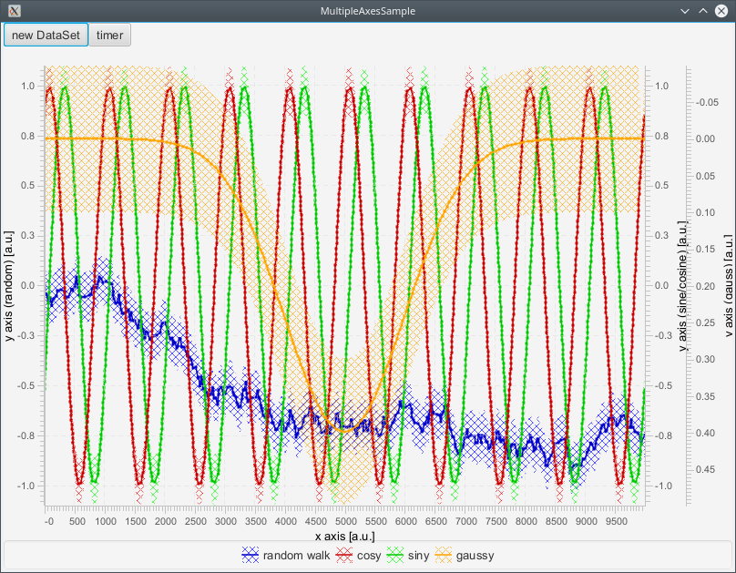<figcaption><a href="chartfx-samples/src/main/java/io/fair_acc/chart/samples/MultipleAxesSample.java">MultipleAxesSample.java</a></figcaption></figure></td>
<td><figure>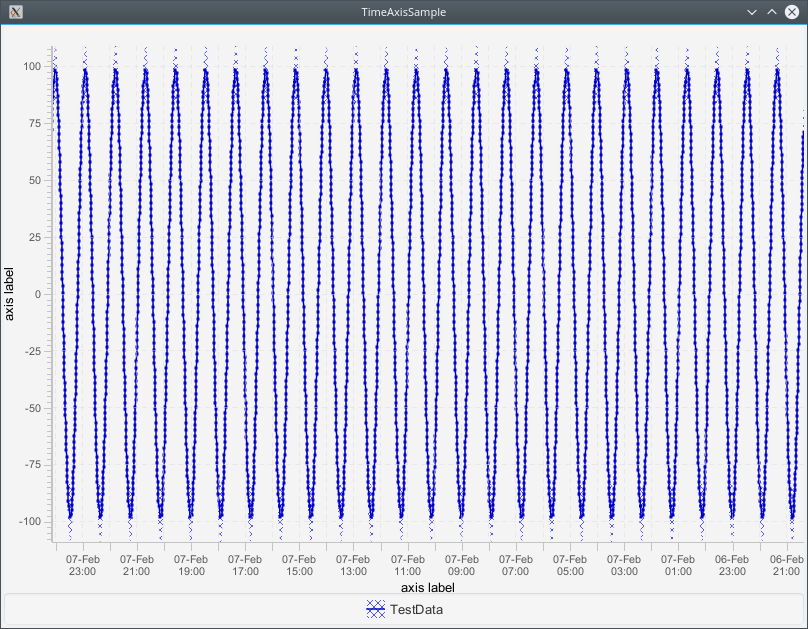<figcaption><a href="chartfx-samples/src/main/java/io/fair_acc/chart/samples/TimeAxisSample.java">TimeAxisSample.java</a></figcaption></figure></td>                         
</tr>

<tr>
<td><figure>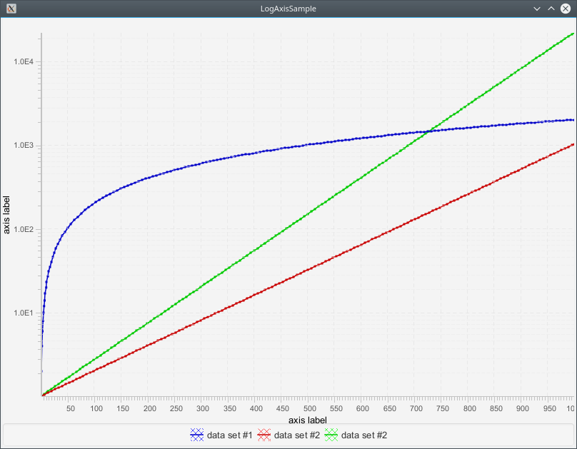<figcaption><a href="chartfx-samples/src/main/java/io/fair_acc/chart/samples/LogAxisSample.java">LogAxisSample.java</a></figcaption></figure></td>
<td><figure>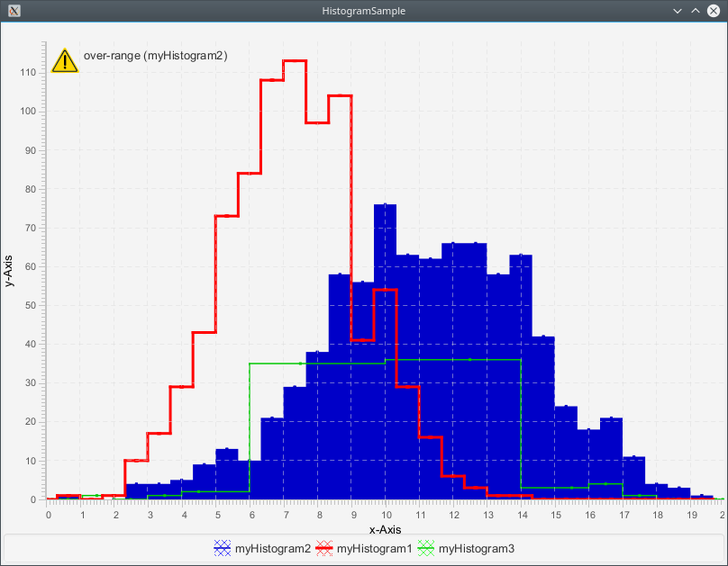<figcaption><a href="chartfx-samples/src/main/java/io/fair_acc/chart/samples/HistogramSample.java">HistogramSample.java</a></figcaption></figure></td>
<td><figure>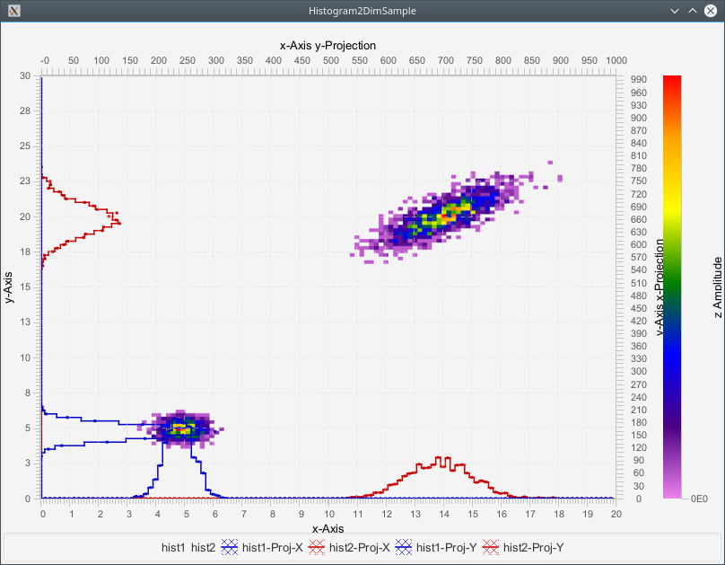<figcaption><a href="chartfx-samples/src/main/java/io/fair_acc/chart/samples/Histogram2DimSample.java">Histogram2DimSample.java</a></figcaption></figure></td>
</tr>

<tr>
<td><figure>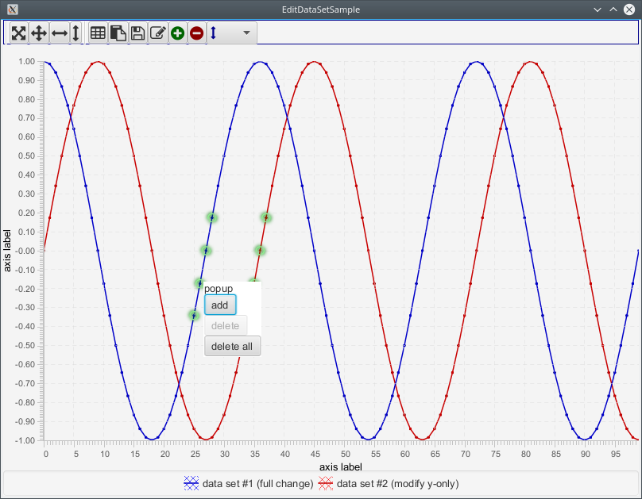<figcaption><a href="chartfx-samples/src/main/java/io/fair_acc/chart/samples/EditDataSetSample.java">EditDataSetSample.java</a></figcaption></figure></td>
<td><figure>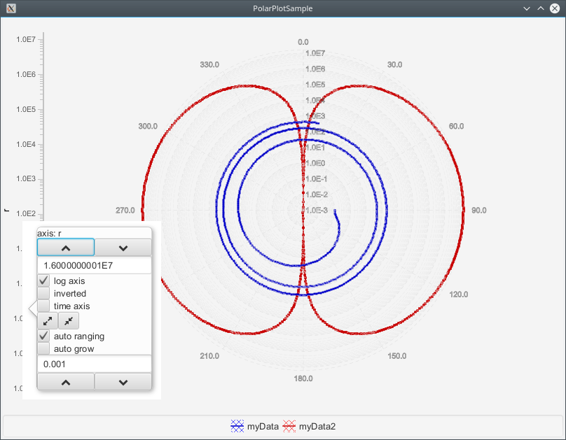<figcaption><a href="chartfx-samples/src/main/java/io/fair_acc/chart/samples/PolarPlotSample.java">PolarPlotSample.java</a></figcaption></figure></td>                
<td><figure>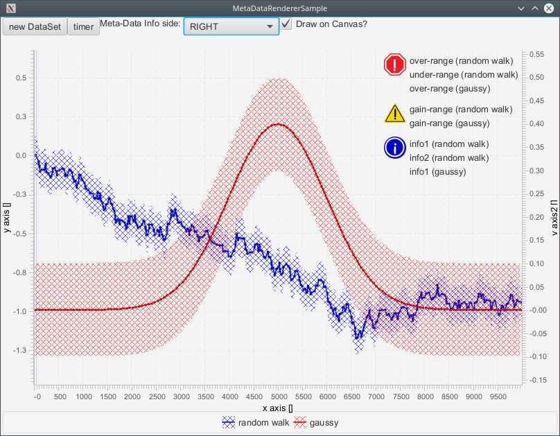<figcaption><a href="chartfx-samples/src/main/java/io/fair_acc/chart/samples/MetaDataRendererSample.java">MetaDataRendererSample.java</a></figcaption></figure></td>
</tr>

<tr>
<td><figure>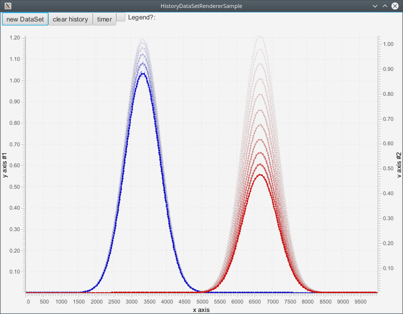<figcaption><a href="chartfx-samples/src/main/java/io/fair_acc/chart/samples/HistoryDataSetRendererSample.java">HistoryDataSetRendererSample.java</a></figcaption></figure></td>
<td><figure>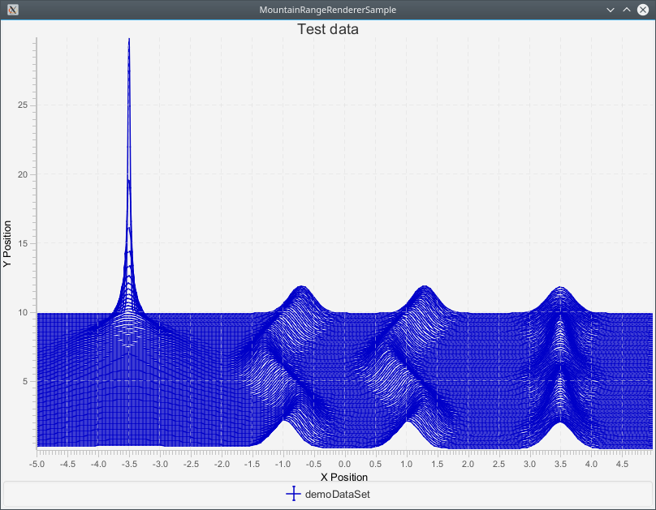<figcaption><a href="chartfx-samples/src/main/java/io/fair_acc/chart/samples/MountainRangeRendererSample.java">MountainRangeRendererSample.java</a></figcaption></figure></td>
<td><figure><figcaption><a href="chartfx-samples/src/main/java/io/fair_acc/chart/samples/ChartAnatomySample.java">ChartAnatomySample.java</a></figcaption></figure></td>
</tr>

<tr>
<td><figure>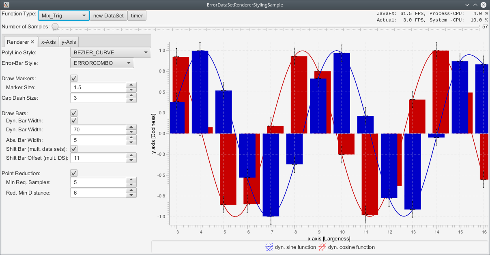<figcaption><a href="chartfx-samples/src/main/java/io/fair_acc/chart/samples/ErrorDataSetRendererStylingSample.java">ErrorDataSetRendererStylingSample.java</a></figcaption></figure></td>
<td><figure>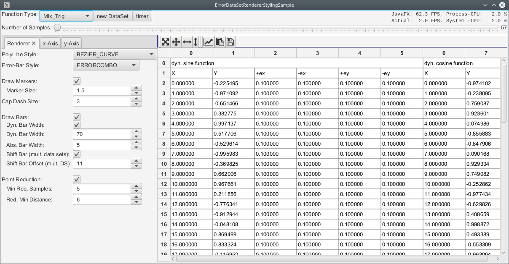<figcaption><a href="chartfx-samples/src/main/java/io/fair_acc/chart/samples/ErrorDataSetRendererStylingSample.java">ErrorDataSetRendererStylingSample.java</a></figcaption></figure></td>
<td><figure>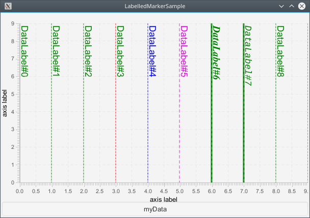<figcaption><a href="chartfx-samples/src/main/java/io/fair_acc/chart/samples/LabelledMarkerSample.java">LabelledMarkerSample.java</a></figcaption></figure></td>
</tr>

<tr>
<td colspan=2><figure>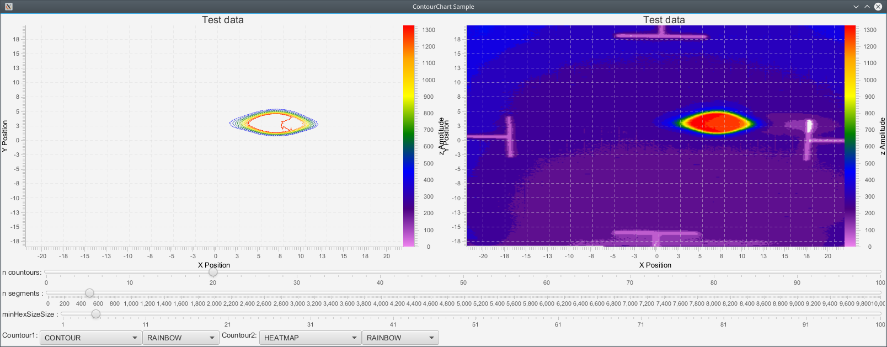<figcaption><a href="chartfx-samples/src/main/java/io/fair_acc/chart/samples/ContourChartSample.java">ContourChartSample.java</a></figcaption></figure></td>
<td><figure>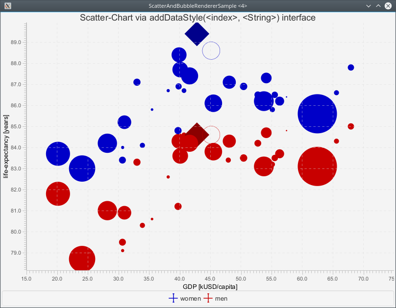<figcaption><a href="chartfx-samples/src/main/java/io/fair_acc/chart/samples/ScatterAndBubbleRendererSample.java">ScatterAndBubbleRendererSample.java</a></figcaption></figure></td>
</tr>
<tr>
<td colspan=2><figure>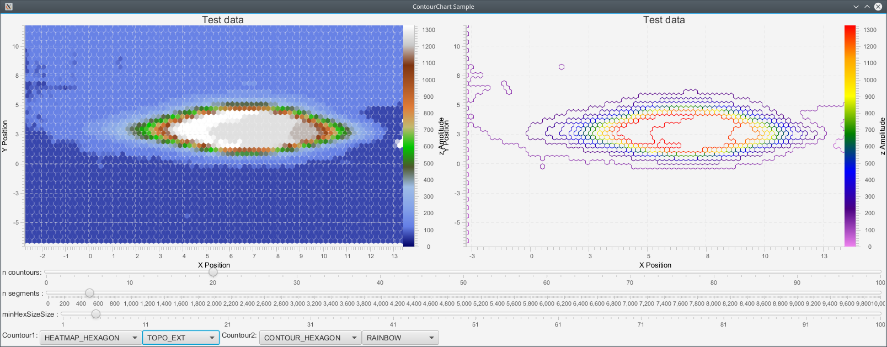<figcaption><a href="chartfx-samples/src/main/java/io/fair_acc/chart/samples/ContourChartSample.java">ContourChartSample.java</a></figcaption></figure></td>
<td><figure>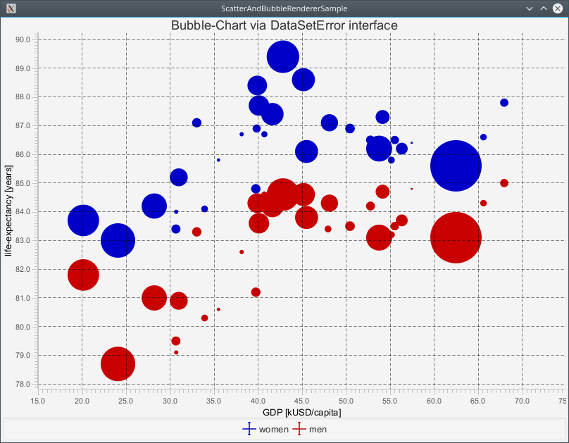<figcaption><a href="chartfx-samples/src/main/java/io/fair_acc/chart/samples/ScatterAndBubbleRendererSample.java">ScatterAndBubbleRendererSample.java</a></figcaption></figure></td>
</tr>

<tr>
<td colspan=2><figure>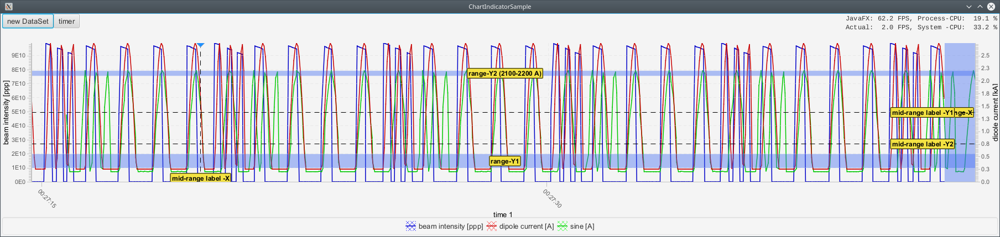<figcaption><a href="chartfx-samples/src/main/java/io/fair_acc/chart/samples/ChartIndicatorSample.java">ChartIndicatorSample.java</a></figcaption></figure></td>         
<td></td>
</tr>

<tr>
<td colspan=2><figure>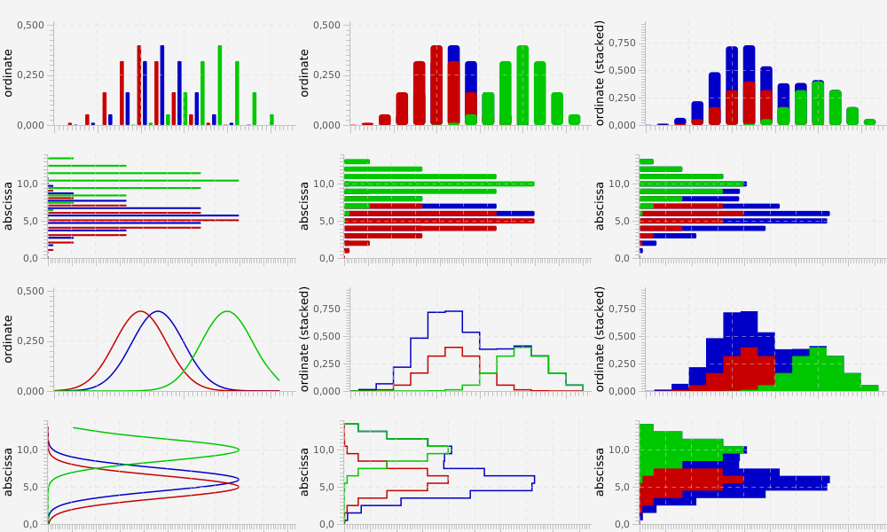<figcaption><a href="chartfx-chart/src/test/java/io/fair_acc/chart/renderer/spi/HistogramRendererTests.java">HistogramRendererTests.java</a></figcaption></figure></td>         
<td></td>
</tr>

</table>

### Financial related examples
Financial charts are types of charts that visually track various business and financial metrics like liquidity, price movement, expenses, cash flow, and others over a given a period of the time. Financial charts are a great way to express a story about business or financial markets (instruments, financial assets).

The chart-fx samples submodule contains financial charts and toolbox samples.

If you want to try them yourself run:

```bash
mvn compile install
mvn exec:java
```

<table>
<tr>
<td><figure>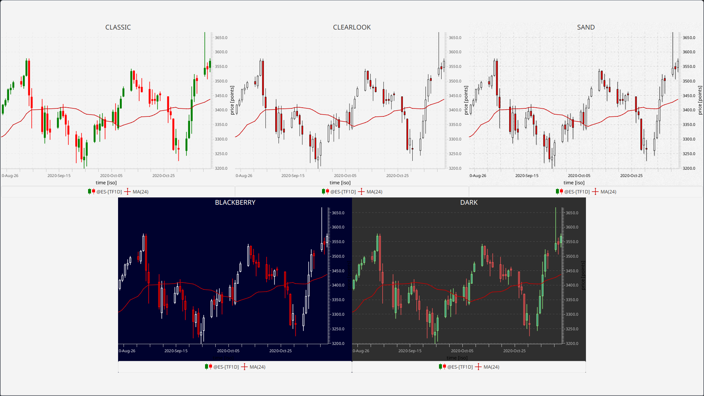<figcaption><a href="chartfx-samples/src/main/java/io/fair_acc/financial/samples/FinancialCandlestickSample.java">FinancialCandlestickSample.java (Several Themes Supported)</a></figcaption></figure></td>
<td><figure>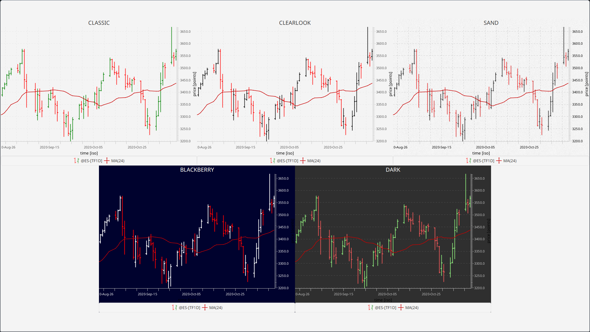<figcaption><a href="chartfx-samples/src/main/java/io/fair_acc/financial/samples/FinancialHiLowSample.java">FinancialHiLowSample.java (OHLC Renderer)</a></figcaption></figure></td>
</tr>
<tr>
<td><figure>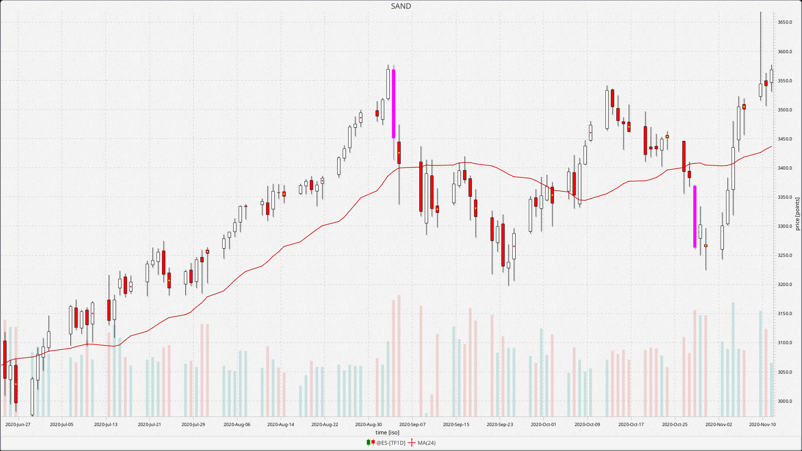<figcaption><a href="chartfx-samples/src/main/java/io/fair_acc/financial/samples/FinancialAdvancedCandlestickSample.java">FinancialAdvancedCandlestickSample.java (Advanced PaintBars and Extension Points)</a></figcaption></figure></td>
<td><figure>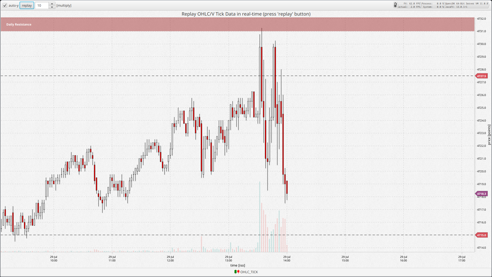<figcaption><a href="chartfx-samples/src/main/java/io/fair_acc/financial/samples/FinancialRealtimeCandlestickSample.java">FinancialRealtimeCandlestickSample.java (OHLC Tick Replay Real-time processing)</a></figcaption></figure></td>
</tr>
</table>

#### Financial Footprint Chart

<figure>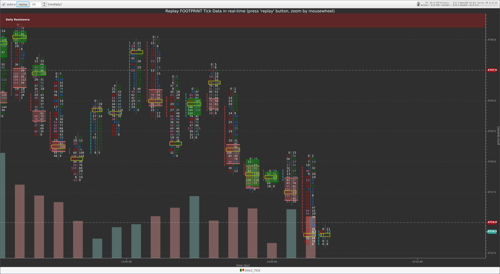<figcaption><a href="chartfx-samples/src/main/java/io/fair_acc/financial/samples/FinancialRealtimeFootprintSample.java">FinancialRealtimeFootprintSample.java (FOOTPRINT Tick Replay Real-time processing)</a></figcaption></figure>

### Math- & Signal-Processing related examples
The math samples can be started by running:

```bash
mvn compile install
mvn exec:java@math
```

<table>
<tr>
<td><figure>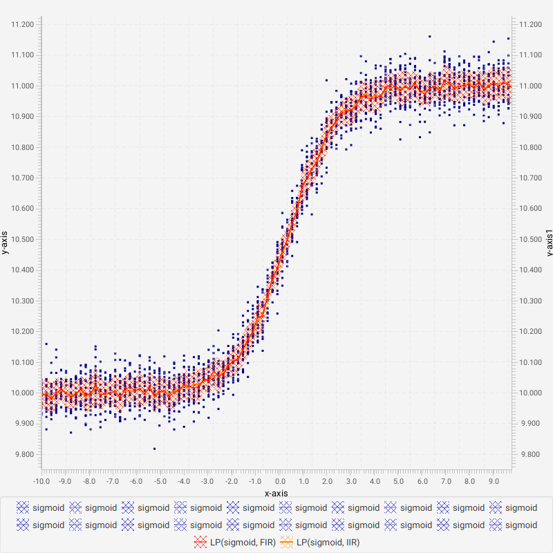<figcaption><a href="chartfx-samples/src/main/java/io/fair_acc/math/samples/DataSetAverageSample.java">DataSetAverageSample.java</a></figcaption></figure></td>
<td><figure>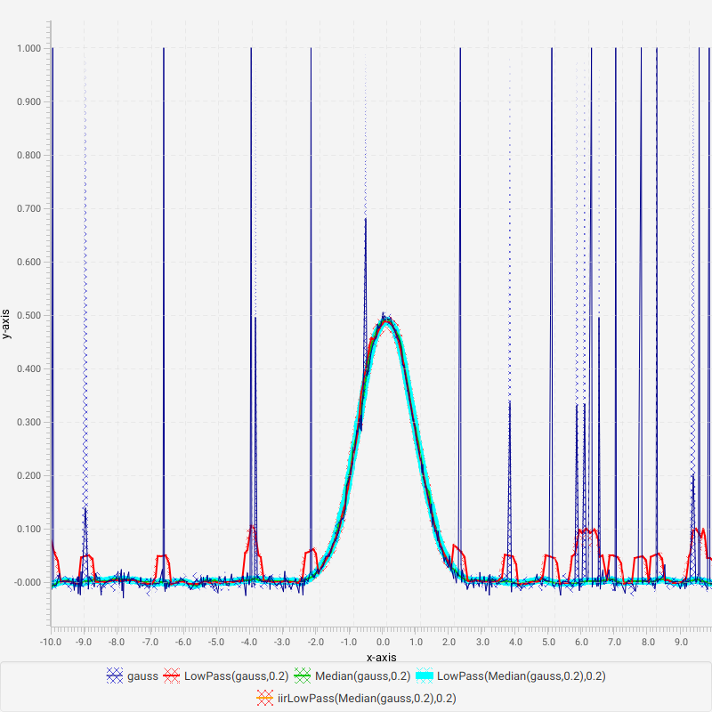<figcaption><a href="chartfx-samples/src/main/java/io/fair_acc/math/samples/DataSetFilterSample.java">DataSetFilterSample.java</a></figcaption></figure></td>
<td><figure>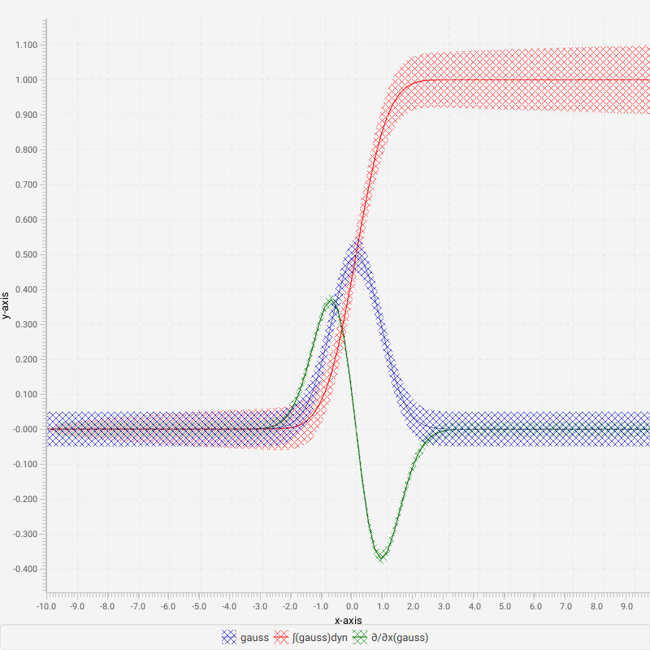<figcaption><a href="chartfx-samples/src/main/java/io/fair_acc/math/samples/DataSetIntegrateDifferentiateSample.java">DataSetIntegrateDifferentiateSample.java</a></figcaption></figure></td>
</tr>

<tr>
<td><figure>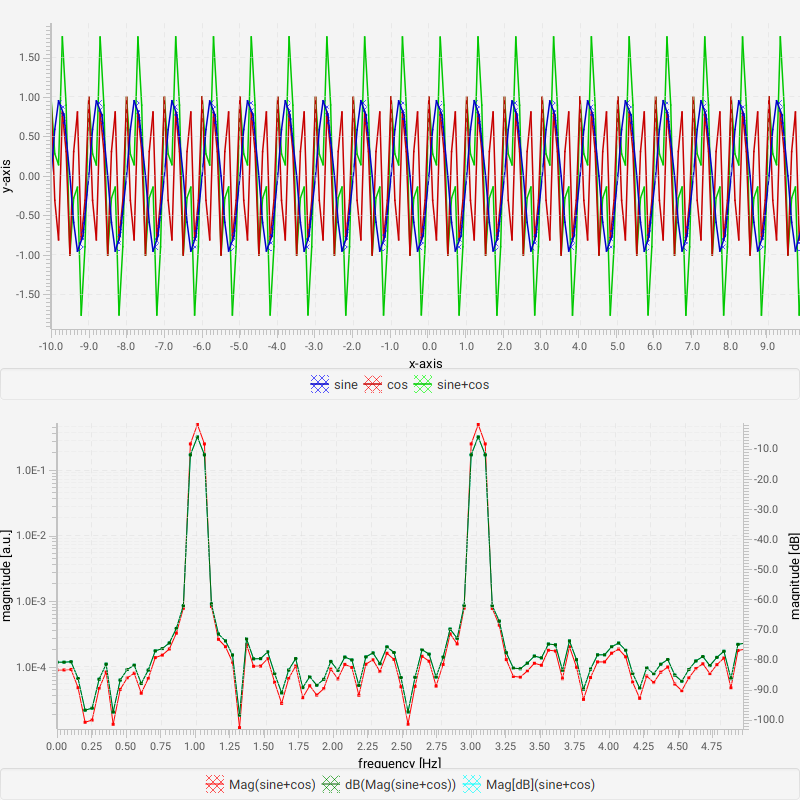<figcaption><a href="chartfx-samples/src/main/java/io/fair_acc/math/samples/DataSetSpectrumSample.java">DataSetSpectrumSample.java</a></figcaption></figure></td>
<td><figure>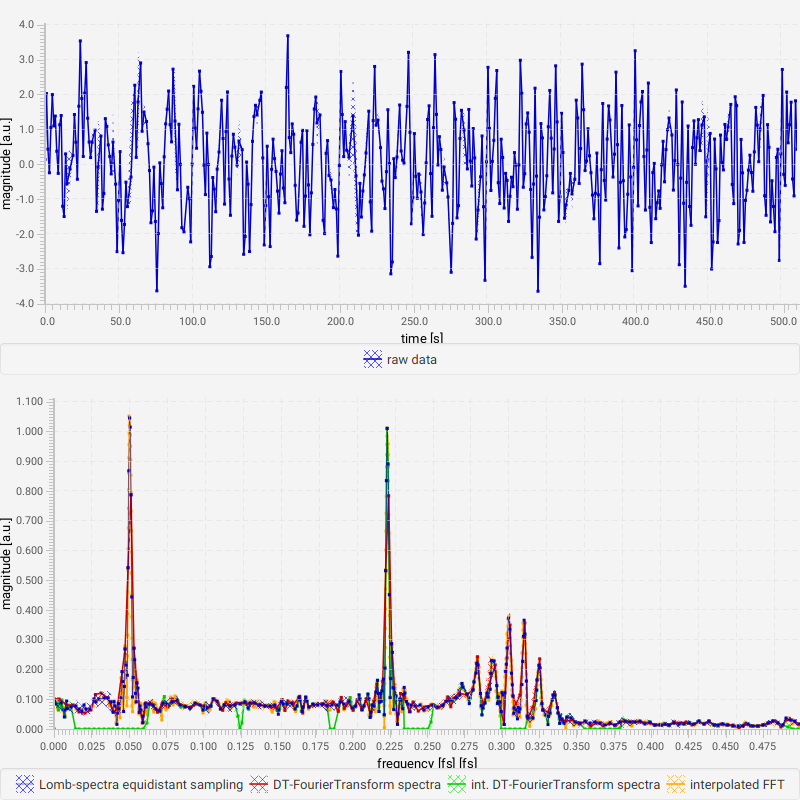<figcaption><a href="chartfx-samples/src/main/java/io/fair_acc/math/samples/FourierSample.java">FourierSample.java</a></figcaption></figure></td>
<td><figure>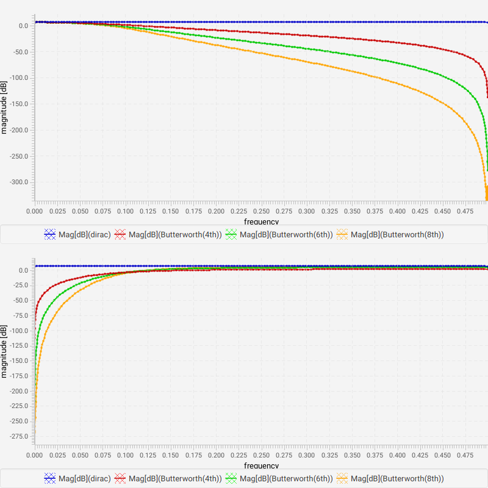<figcaption><a href="chartfx-samples/src/main/java/io/fair_acc/math/samples/FrequencyFilterSample.java">FrequencyFilterSample.java</a></figcaption></figure></td>
</tr>

<tr>
<td><figure><figcaption><a href="chartfx-samples/src/main/java/io/fair_acc/math/samples/GaussianFitSample.java">GaussianFitSample.java</a></figcaption></figure></td>
<td><figure>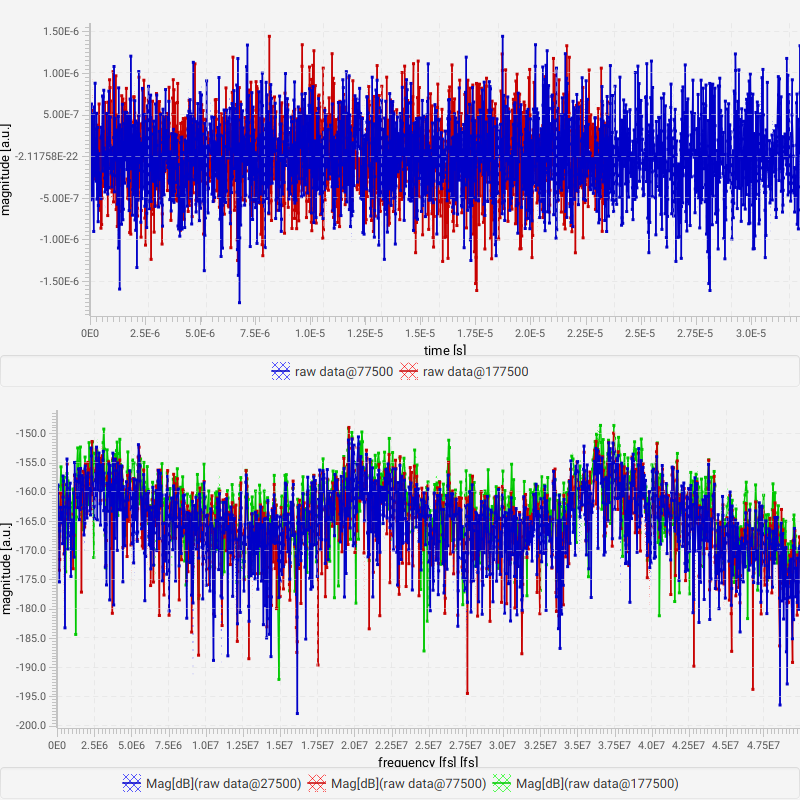<figcaption><a href="chartfx-samples/src/main/java/io/fair_acc/math/samples/IIRFilterSample.java">IIRFilterSample.java</a></figcaption></figure></td>
<td><figure>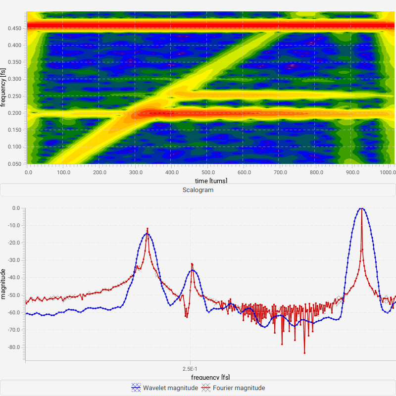<figcaption><a href="chartfx-samples/src/main/java/io/fair_acc/math/samples/WaveletScalogram.java">WaveletScalogram.java</a></figcaption></figure></td>
</tr>
</table>

### Other samples
There are also samples for the dataset and the accelerator UI submodules which will be extended over time as new
functionality is added.

```bash
mvn compile install
mvn exec:java@dataset
mvn exec:java@acc-ui
```

## Performance Comparison
Besides the extended functionality outlined above, the ChartFx optimisation goal also included achieving real-time update rates of up to 25 Hz for data sets with a few 10k up to 5 million data points. In order to optimise and compare the performance with other charting libraries, especially those with only reduced functionality, a reduced simple oscilloscope-style test case has been chosen (see `RollingBufferSample` in demos) that displays two curves with independent auto-ranging y-axes, common sliding time-series axis, and without further `ChartPlugin`s. The test-case and direct performance comparison between the ChartFx and JavaFX charting library for update rates at 25 Hz and 2 Hz is shown below.

<table style="width:100%">
<tr><td colspan=2><figure>
	
  	<figcaption>Performance test scenario with two independent graphs, independent auto-ranging y-axes, and common scrolling time-series axis. Test system: Linux, 4.12.14, Intel(R) Core(TM) i7 CPU 860 @2.80GHz and GeForce GTX 670 GPU (NVIDIA driver).</figcaption>
</figure></td></tr>
<tr><td><figure>
	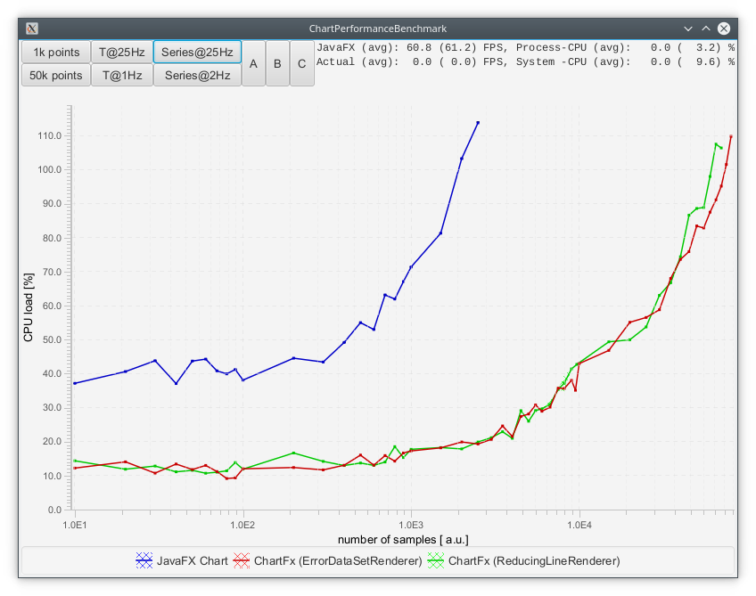
  	<figcaption>Performance comparison @ 25 Hz update rate.</figcaption>
</figure></td>
<td><figure>
  	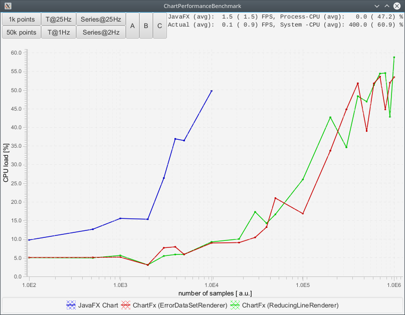
  	<figcaption>Performance comparison @ 2 Hz update rate.</figcaption>
</figure></td></tr>
</table>

While the ChartFx implementation already achieved a better functionality and a by two orders of magnitude improved performance for very large datasets, the basic test scenario has also been checked against popular existing Java-Swing and non-Java based UI charting frameworks. The Figure below provides a summary of the evaluated chart libraries for update rates at 25 Hz and 1k samples.

<figure>
  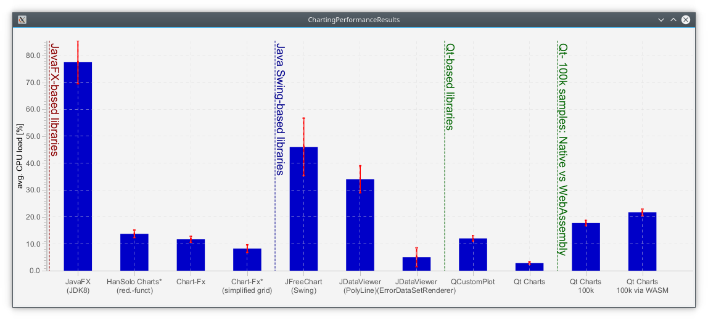
  <figcaption>
  Chart performance comparison for popular JavaFX, Java-Swing, C++/Qt and WebAssembly-based implementations: <a href="https://github.com/extjfx/extjfx">ExtJFX</a>, <a href="https://github.com/fair-acc/chart-fx">ChartFx</a>, <a href="https://github.com/HanSolo/charts">HanSolo Charts</a>, <a href="http://www.jfree.org/jfreechart/">JFreeChart</a>, <a href="https://cds.cern.ch/record/1215878">JDataViewer</a>, <a href="https://www.qcustomplot.com/">QCustomPlot</a>, <a href="https://doc.qt.io/qt-5/qtcharts-index.html">Qt-Charts</a>, <a href="https://doc.qt.io/qt-5/wasm.html">WebAssembly</a>. The last `Qt Charts` entries show results for 100k data points being updated at 25 Hz.
  </figcaption>
</figure>

## Some thoughts
While starting out to improve the JDK's JavaFX Chart functionality and performance through initially extending, then gradually replacing bottle-necks, and eventually re-designing and replacing the original implementations, the resulting ChartFx library provides a substantially larger functionality and achieved an about two orders of magnitude performance improvement.
Nevertheless, improved functionality aside, a direct performance comparison even for the best-case JavaFX scenario (static axes) with other non-JavaFX libraries demonstrated the raw JavaFX graphics performance -- despite the redesign -- being still behind the existing Java Swing-based JDataViewer and most noticeable the Qt Charts implementations. The library will continued to be maintained here at GitHub and further used for existing and future JavaFX-based control room UIs at GSI.
The gained experience and interfaces will provide a starting point for a planned C++-based counter-part implementation using Qt or another suitable low-level charting library.

## Working on the source
If you want to work on the chart-fx sourcecode, either to play with the samples or to contribute some improvements to chartFX here are some instructions how to obtain the source and compile it using maven on the command line or using eclipse.

### Maven on the command line
Just clone the repository and run maven from the top level directory. The `exec:java` target can be used to execute the samples.
Maven calls java with the corresponding options so that JavaFX is working. Because of the way the project is set up, only classes in the chartfx-samples project can be started this way.


```sh
git clone
cd chart-fx
mvn compile install
mvn exec:java
```

### Eclipse
The following has been tested with eclipse-2019-03 and uses the m2e maven plugin. Other versions or IDEs might work similar.
Import the repository using `Import -> Existing Maven Project`.
This should import the parent project and the four sub-projects.
Unfortunately, since chartfx does not use the jigsaw module system, but javafx does, running the samples using 'run as Java Application' will result in an error complaining about the missing JavaFX runtime.
As a workaround we include a small helper class `LaunchJFX`, which can be called with 'run as Java Application' and which launches the sample application.
It accepts a class name as an argument, so if you edit the run configuration and put `${java_type_name}` as the argument, it will try to start the class selected in the project explorer as a JavaFX application.

### JavaFX jvm command line options

If you cannot use the 2 previous methods it is also possible to manually specify the access rules to the module system
as jvm flags. Adding the following to the java command line call or your IDEs run configuration makes the required
modules available and accessible to chartfx:

```
--add-modules=javafx.graphics,javafx.fxml,javafx.media
--add-reads javafx.graphics=ALL-UNNAMED
--add-opens javafx.controls/com.sun.javafx.charts=ALL-UNNAMED
--add-opens javafx.controls/com.sun.javafx.scene.control.inputmap=ALL-UNNAMED
--add-opens javafx.graphics/com.sun.javafx.iio=ALL-UNNAMED
--add-opens javafx.graphics/com.sun.javafx.iio.common=ALL-UNNAMED
--add-opens javafx.graphics/com.sun.javafx.css=ALL-UNNAMED
--add-opens javafx.base/com.sun.javafx.runtime=ALL-UNNAMED
--add-exports javafx.controls/com.sun.javafx.scene.control.behavior=ALL-UNNAMED
```

As these parameters might change as dependencies get updated and depending on the way your project is set up,
please check the following resources if you encounter problems with module accessibility:
- [ControlsFX wiki about module visibility problems](https://github.com/controlsfx/controlsfx/wiki/Using-ControlsFX-with-JDK-9-and-above#understanding-exceptions)
- [Blogpost with a brief explanation about the different parameters and how to use them](https://nipafx.dev/five-command-line-options-hack-java-module-system/)

### Extending chartfx
If you find yourself missing some feature or not being able to access specific chart internals, the way to go is often to
implement a custom plugin or renderer.

Plugins are a simple way to add new visualisation and interaction capabilities to chart-fx. In fact a lot of chart-fx' own features (e.g. zoom, data editing, measurements) are implemented as plugins, as you can see in the sample applications.
Your plugin can directly extend ChartPlugin or extend any of the builtin plugins.
The Plugin Base class provides you with access to the chart object using `getChart()`.
Your plugin should always add a Listener to the chartProperty, because when it is created there will not be an associated
chart, so at creation time, calls to e.g. `getChart()` will return null.
Using a custom plugin boils down to adding it to the chart by doing `chart.getPlugins().add(new MyPlugin())`.
If you wrote a plugin which might be useful for other users of chart-fx please consider doing a pull request against chart-fx.

Renderers are the components which do the actual heavy lifting in drawing the components of the graph to the canvas.
A chart can have multiple renderers added using `chart.getRenderers().add(...)`
There are renderers which visualise actual data like the `ErrorDataSetRenderer` which is also the renderer added
to new charts by default.
These Renderers operate on all DatasSets added to the chart (`chart.getDatasets.add(...)`) as well as on the ones added
to the renderer itself.
As a rule of thumb, you need to implement a custom renderer if you need to visualize lots of data points or if you want
to draw something behind the chart itself.

### Acknowledgements
We express our thanks and gratitude to the JavaFX community, in particular to @GregKrug and Vito Baggiolini at CERN for their valuable insights, discussions and feedback on this topic.
