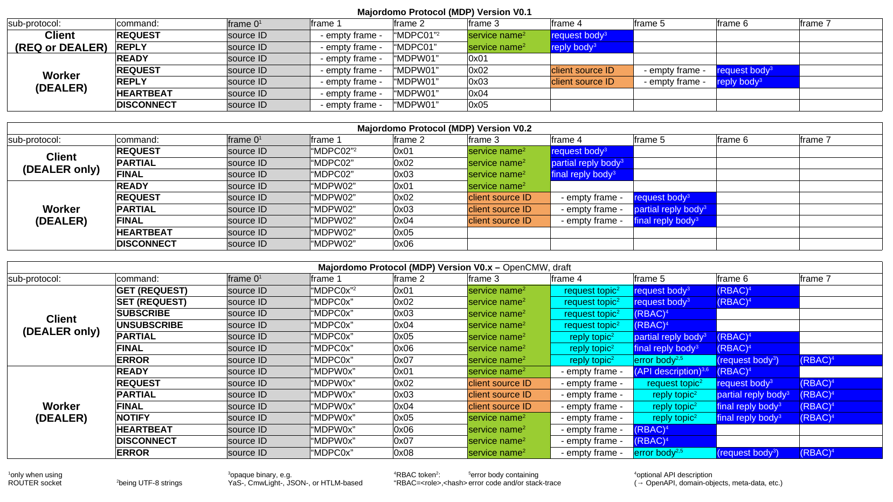

# Majordomo Protocol (MDP) TL;DR; Comparison

Brief summary of definitions in:
   * MDP v 0.1: https://rfc.zeromq.org/spec/7/
   * MDP v 0.2: https://rfc.zeromq.org/spec/18/
   * Majordomo Management Interface (MMI): https://rfc.zeromq.org/spec/8/

and OpenCMW protocol extension proposal ([pdf](Majordomo_protocol_comparison.pdf), [spreadsheet source](Majordomo_protocol_comparison.ods)):    

  
  